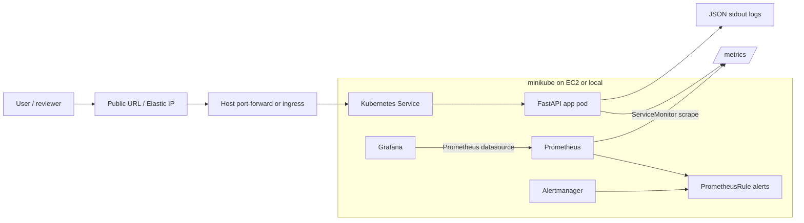

# Architecture

## Notes

- The app is packaged as a Docker image and deployed with the Helm chart in `chart/insiderone-devops-app`.
- Prometheus discovers app metrics through the chart's `ServiceMonitor`.
- Grafana uses the Prometheus datasource installed by `kube-prometheus-stack`.
- The high-error-rate alert is managed as a `PrometheusRule` in the app chart.
